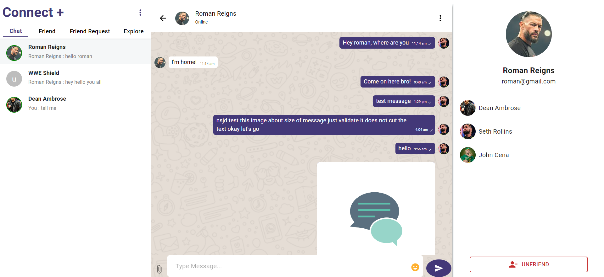
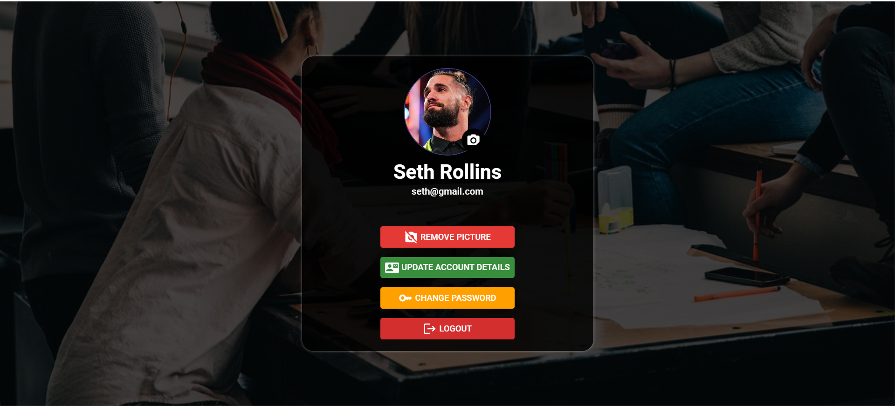

# Connect+

Connect+ is a  messaging application that allows users to communicate with each other . It is full stack chat application built using react for frontend and other major technologies.
<!-- and integrates with Socket.IO for real-time communication. -->

---

## Features

<!-- - **Real-time Messaging**: Instant communication with other users in chat rooms. -->
<!-- - **Group Chats**: Create and manage group conversations with multiple participants. -->
- **User Profiles**: Each user has a profile with personal information.
- **Online Status**: Users can see who is online and when others were last seen.
- **User Management**: Add friends and manage connections.
- **Friend Request**: Send and send friend requests to connect.
- **media**: user can send image or documents with message
- **update**: user can update their details like username,email and change profile picture and can update password also

## Technologies Used

- **Frontend**: React, Redux Toolkit, Material-UI
- **Backend**: Node.js, Express,
- **Database**: MongoDB ,
- **Authentication**: JWT (JSON Web Tokens) for secure user authentication

## Usage

- **Sign Up / Log In**: Users can create an account or log in to their existing account.
- **Start Chatting**: Users can start new conversations or join existing ones.
- **Create Group Chats**: Users can create and invite others to group chats.
- **Manage Friends**: Users can send friend requests and manage their friend list